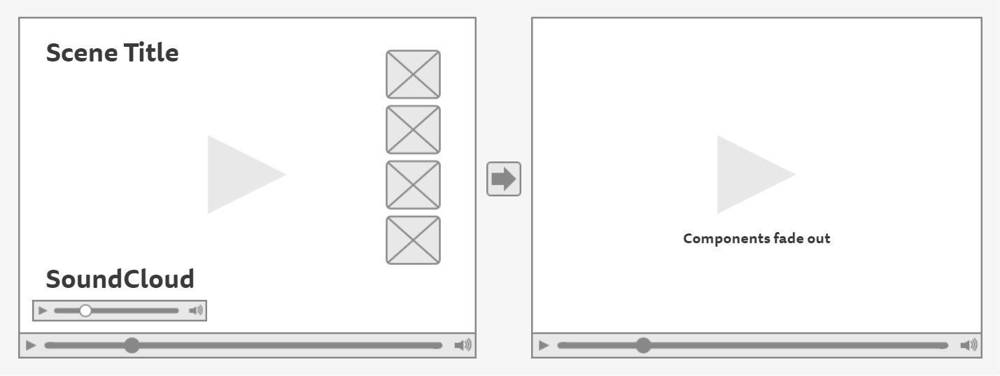

# Breathe
<a href="https://breathe-app.herokuapp.com/">Breathe</a> is an experimental, single-page application focused on helping users relax, meditate, and find peace of mind.


## Getting started
### Install
```
git clone https://github.com/NOUX-NOVA/breathe.git
cd breathe
npm install
```
### Run
```
npm run dev
```
Then open `localhost:8000` in a browser.
### Test
```
npm run test
```


## About
It's no secret that meditation is beneficial to our health. In fact, a recent study from <a href="http://news.harvard.edu/gazette/story/2011/01/eight-weeks-to-a-better-brain/">Harvard</a> showed that meditation can lead to changes in brain structure that provide cognitive and psychological benefits. Breathe is an experimental application that seamlessly combines API data from YouTube and SoundCloud to help the user find peace of mind by presenting relaxing imagery and sounds in full-screen format.

## How it Works
Users are able to choose between 4 different scenes, each with its own accompanying audio. Although the video is embedded from YouTube and the audio is embedded from SoundCloud, the files were handpicked and carefully edited to provide the user with a seamless experience.

After 5 second of inactivity, all components (including the mouse but excluding the video) will fade out to really help immerse the user in the currently selected scene.

### Caveat
Due to the experimental design of the application and the inability of mobile devices to autoload video and audio media, an image that kindly requests the user to view the application on a larger viewport has been implemented below a width of 600px.

## Technology
* HTML5
* CSS3
* JavaScript
* jQuery
* React
* Redux
* React-Router
* <a href="https://mochajs.org/">Mocha</a> + <a href="http://chaijs.com/">Chai</a> (testing)
* Continuous integration and deployment with <a href="https://travis-ci.org/">Travis CI</a>

## Attributions
#### Fade out mouse cursor when inactive (with jQuery)
* <a href="http://stackoverflow.com/questions/15532423/fade-out-mouse-cursor-when-inactive-with-jquery">http://stackoverflow.com/questions/15532423/fade-out-mouse-cursor-when-inactive-with-jquery</a>
* <a href="http://stackoverflow.com/users/708700/michael-b">Michael_B</a>

#### FullScreen YouTube Video Background In Pure CSS
* <a href="http://thenewcode.com/">Dudley Storey</a>
* <a href="https://codepen.io/dudleystorey/pen/PZyMrd">CodePen</a>
* Used under <a href="https://creativecommons.org/licenses/by-nc-sa/2.5/ca/">Attribution-NonCommercial-ShareAlike 2.5 Canada</a>

#### All videos from <a href="https://videos.pexels.com/">Pexels</a> under the <a href="https://videos.pexels.com/video-license">Creative Commons Zero (CC0) license</a>.